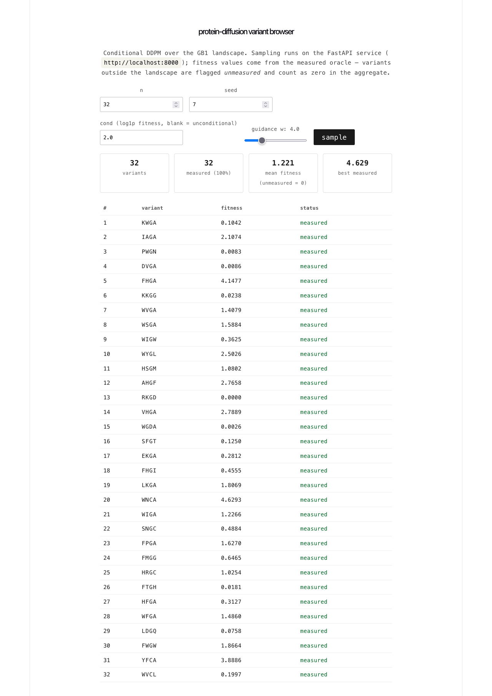

# Variant browser

Minimal client for the FastAPI sampling service in `../src/protein_diffusion/serve.py`.
Posts to `POST /sample`, renders the returned variants with their oracle
status, and reports the same honest aggregates the pipeline uses:
measured fraction, mean fitness with unmeasured variants counted as
zero, and best measured hit.

## Run

```bash
# terminal 1: API (from repo root)
MODEL_PATH=data/processed/ddpm.pt \
  ../.venv/bin/uvicorn protein_diffusion.serve:app --port 8000

# terminal 2: this app
npm install
npm run dev        # or: npm run build && npm run preview
```

`VITE_API_URL` overrides the API base (default `http://localhost:8000`).
CORS on the service is restricted to the vite dev/preview ports.



The screenshot shows a real run: 32 variants at guidance w=4, cond 2.0,
100% measured, mean fitness 1.221, best measured 4.629.
